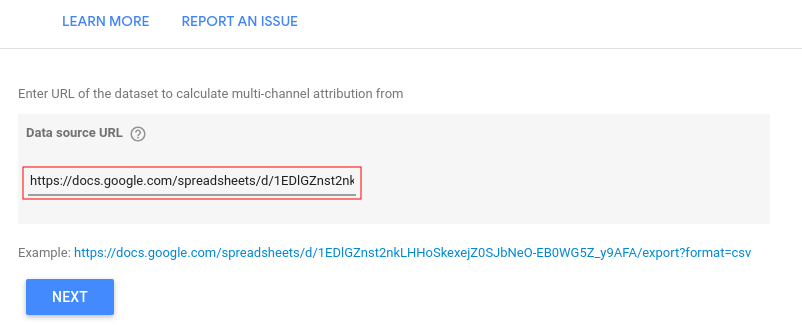

# Multi-Channel Attribution Data Studio connector

 

Have a dataset  like <a href="https://docs.google.com/spreadsheets/d/1EDlGZnst2nkLHHoSkexejZ0SJbNeO-EB0WG5Z_y9AFA/" target="_blank">this</a> and looking for the simplest way to attribute conversions over marketing channels?

<table class="table table-striped table-borderless table-hover">
  <thead>
    <tr>
      <th scope="col">Path</th>
      <th scope="col">Total conversions</th>
      <th scope="col">Total conversion value</th>
    </tr>
  </thead>
  <tbody>
    <tr><td>google > cj</td><td>1</td><td>122.7967617</td></tr>
    <tr><td>google > google > vergelijk > google</td><td>1</td><td>706.2702523</td></tr>
    <tr><td>google > seznam > seznam</td><td>1</td><td>4683.237052</td></tr>
    <tr><td>google > cj</td><td>1</td><td>437.7382795</td></tr>
    <!-- <tr><td>google > exponea > google > exponea</td><td>1</td><td>2018.351625</td></tr> -->
  </tbody>
</table>

<!--   -->

Good news then - we've made a connector for it.

 

## Here's how to use it

<!--   -->

* in Google Data Studio, search for `Multi-Channel Attribution`

  

 

* provide a URL to the dataset

  

 

* choose columns to be used

  

 

* and a model to attribute with

  

 

* for Markov model, also specify order (optional)

  

 

* we're almost there!  Double-check the settings, and click `Add`

  

 

* and that's it!  Now use the datasource with attributed conversions as you would use any other in Data Studio

  

 

And here's our [Terms of Service and Privacy Policy](/tos-and-privacy.html).
